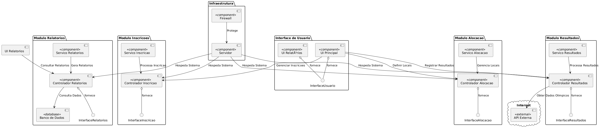
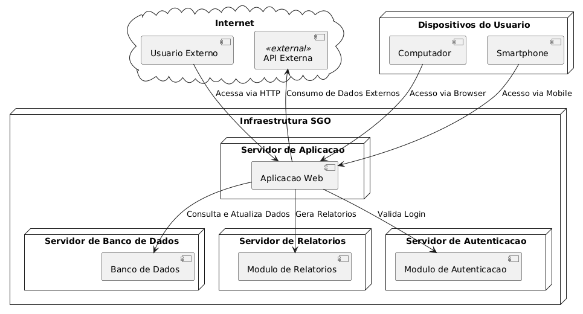
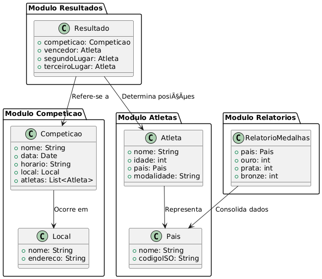
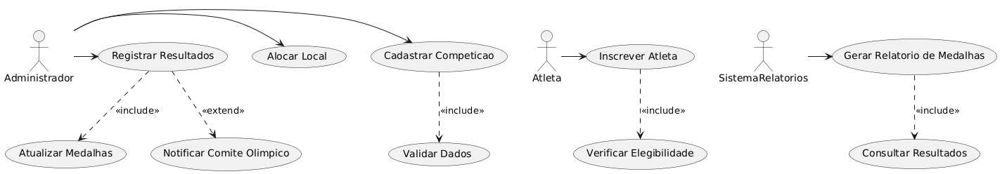

## Sobre o PlantUML

O PlantUML é uma ferramenta open-source criada em 2009 com o propósito de gerar diagramas UML de forma programática, utilizando uma linguagem de marcação simples. Ele é amplamente utilizado para diagramas de classes, sequências, casos de uso, entre outros, e é suportado por várias ferramentas de desenvolvimento. O projeto PlantUML utiliza a biblioteca Graphviz para renderização gráfica, sendo uma solução poderosa e flexível para documentação e modelagem de software.

---

## Histórias de Usuário

### Como um **Administrador**, eu quero **gerenciar usuários no sistema**, para que **eu possa controlar permissões e acessos**.
**Critérios de Aceitação:**
Deve ser possível adicionar, editar e remover usuários.
O sistema deve validar permissões antes de conceder acesso.
Logs de alterações devem ser armazenados para auditoria.

### Como um **Coordenador Acadêmico**, eu quero **visualizar e alocar alunos em disciplinas**, para que **eu possa organizar turmas de forma eficiente**.
**Critérios de Aceitação:**
Deve ser possível listar alunos inscritos em cada disciplina.
O sistema deve sugerir alocações com base em critérios como carga horária e disponibilidade.
Alocações devem ser registradas para consultas futuras.

### Como um **Aluno**, eu quero **realizar minha inscrição nas disciplinas do semestre**, para que **eu possa garantir minha vaga nas matérias desejadas**.
**Critérios de Aceitação:**
Deve ser possível visualizar disciplinas disponíveis e horários.
O sistema deve impedir conflitos de horários na inscrição.
A inscrição deve ser confirmada por e-mail.

### Como um **Professor**, eu quero **gerar relatórios de alunos inscritos**, para que **eu possa acompanhar a distribuição de alunos por disciplina**.
**Critérios de Aceitação:**
O relatório deve conter nome, matrícula e status do aluno.
Deve ser possível exportar o relatório em PDF e CSV.
Relatórios devem ser acessíveis apenas para professores das disciplinas.

### Como um **Administrador**, eu quero **implementar autenticação com login e senha**, para que **o acesso ao sistema seja seguro**.
**Critérios de Aceitação:**
O sistema deve permitir login e logout seguros.
Deve haver restrições de acesso com base em permissões.
O sistema deve bloquear contas após várias tentativas falhas.

### Como um **Aluno**, eu quero **visualizar meu histórico acadêmico**, para que **eu possa acompanhar meu desempenho ao longo dos semestres**.
**Critérios de Aceitação:**
O histórico deve conter todas as disciplinas cursadas e suas respectivas notas.
Deve ser possível exportar o histórico em PDF.
Apenas o aluno e administradores devem ter acesso a esse histórico.

### Como um **Professor**, eu quero **enviar notificações para os alunos da minha disciplina**, para que **eu possa informá-los sobre prazos e eventos importantes**.
**Critérios de Aceitação:**
Deve ser possível enviar notificações por e-mail e dentro do sistema.
Notificações devem ser exibidas no painel do aluno.
Os alunos devem poder marcar notificações como lidas.

### Como um **Aluno**, eu quero **solicitar a troca de disciplina**, para que **eu possa ajustar minha grade horária conforme necessário**.
**Critérios de Aceitação:**
O sistema deve verificar a disponibilidade de vagas antes da troca.
A solicitação deve ser analisada pelo coordenador acadêmico.
O aluno deve receber uma notificação sobre a aprovação ou rejeição da troca.

### Como um **Aluno**, eu quero **realizar pagamentos de mensalidade online**, para que **eu possa evitar atrasos e garantir minha matrícula ativa**.
**Critérios de Aceitação:**
O sistema deve permitir pagamentos via cartão de crédito e boleto bancário.
Deve ser possível visualizar o status dos pagamentos realizados.
O sistema deve enviar lembretes de vencimento da mensalidade.

### Como um **Administrador**, eu quero **realizar backup automático dos dados do sistema**, para que **eu possa garantir a segurança das informações**.
**Critérios de Aceitação:**
O sistema deve criar backups periódicos automaticamente.
Deve ser possível restaurar dados a partir de um backup.
Apenas administradores devem ter permissão para acessar os backups.

---

## Capturas de Tela

|  |
|:---------------------:|
| component_diagram |

|  |
|:---------------------:|
| deployment_diagram |

|  |
|:---------------------:|
| package_diagram |

|  |
|:---------------------:|
| use_case_diagram |

---

## Desenvolvedores

   - Guilherme Henrique 
   - Gustavo Prehl

## Links para Arquivos `.puml`

- [package_diagram.puml](plantuml_code/package_diagram.puml)
- [use_case_diagram.puml](plantuml_code/use_case_diagram.puml)
- [component_diagram_updated.puml](plantuml_code/component_diagram_updated.puml)
- [deployment_diagram_updated.puml](plantuml_code/deployment_diagram_updated.puml)

---

## Documentação Adicional

- [PlantUML Language Reference Guide](plantuml_language_reference_guide_en/PlantUML_Language_Reference_Guide_en.pdf)

---

## Links Úteis

- [PlantUML Site Oficial](https://plantuml.com/)
- [PlantUML Download](https://plantuml.com/download)
- [PlantUML API](https://www.plantuml.com/plantuml/uml)
- [PyPI - Requests](https://pypi.org/project/requests/)